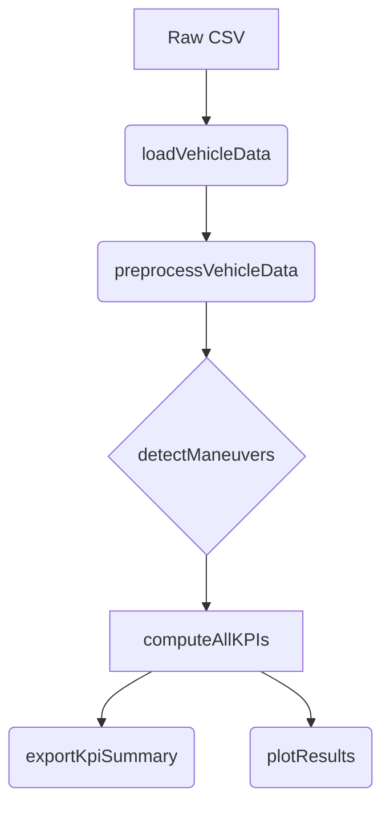

# Developer Guide - Vehicle Dynamics KPI Toolbox

## Architecture Overview
The toolbox follows a modular pipe-and-filter architecture. Data flows linearly from raw input to final metrics, ensuring that each step is isolated and testable.

### 1. IO Layer (`src/io/`)
- **Responsibility**: Interface with the filesystem.
- **Key Function**: `loadVehicleData` handles CSV parsing and basic column validation.
- **Design Choice**: Uses `detectImportOptions` for robustness against different CSV formats.

### 2. Preprocessing Layer (`src/prep/`)
- **Responsibility**: Signal conditioning.
- **Sequence**: `removeMissingSamples` -> `resampleVehicleData` -> `lowPassFilterSignal`.
- **Validation**: `validateVehicleData` ensures all required signals are present before proceeding.

### 3. Maneuver Layer (`src/maneuvers/`)
- **Responsibility**: Temporal segmentation.
- **Logic**: Identifies "windows of interest" using trigger logic on steering angle.

### 4. Core Layer (`src/core/`)
- **Responsibility**: Scientific computation.
- **Functions**: Specialized modules for `Handling`, `Steering`, and `Ride`.
- **Theory**: `simulateBicycleModel` provides the linear reference for comparison.

## Data Flow Diagram

## Coding Standards
- **Naming**: Use `camelCase` for variables and functions.
- **Error IDs**: All errors must use the `vdt:component:errorName` format.
- **Documentation**: Every function must include a standard MATLAB help header (H1 line) and internal comments for complex logic.

## Testing Policy
Before every release/push:
1. Run `runtests('tests/ToolboxTest.m')`.
2. Ensure `validateRobustness.m` shows a gain error < 5% on the default dataset.
