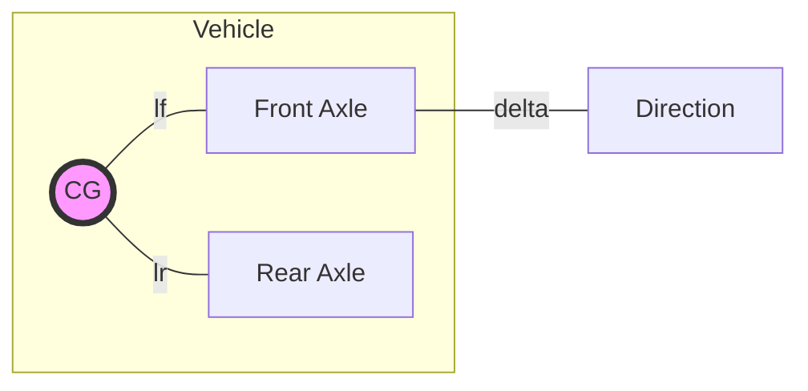

# Advanced Vehicle Dynamics: Mathematical & Physical Foundations

This document provides a comprehensive deep dive into the physics and mathematics governing the Vehicle Dynamics KPI Toolbox. It is designed to serve as a reference for rigorous technical reviews.

---

## 1. The Bicycle Model (Single Track Model)

The core theoretical reference of this toolbox is the **Linear Bicycle Model**. It simplifies the 4-wheeled vehicle into a two-wheeled representation, assuming lateral load transfer is negligible and tires operate in the linear region.

### 1.1 Geometry and Kinematics

- **$L$**: Wheelbase ($l_f + l_r$)
- **$\delta$**: Front wheel steer angle
- **$\beta$**: Sideslip angle (angle between velocity vector and longitudinal axis)
- **$r$**: Yaw rate ($\dot{\psi}$)

### 1.2 Equations of Motion
The lateral dynamics are described by two coupled differential equations (sum of lateral forces and sum of moments around CG):

1.  **Lateral Force**: $m(\dot{v}_y + v_x r) = F_{yf} + F_{yr}$
2.  **Yaw Moment**: $I_z \dot{r} = l_f F_{yf} - l_r F_{yr}$

Assuming linear tire models ($F_y = C_{\alpha} \alpha$):
- $F_{yf} = C_f \left( \delta - \beta - \frac{l_f r}{v_x} \right)$
- $F_{yr} = C_r \left( -\beta + \frac{l_r r}{v_x} \right)$

### 1.3 State-Space Representation
For a constant longitudinal velocity $v_x$, the system is linear time-invariant (LTI):
$$\begin{bmatrix} \dot{\beta} \\ \dot{r} \end{bmatrix} = \begin{bmatrix} -\frac{C_f+C_r}{mv_x} & \frac{C_r l_r - C_f l_f}{mv_x^2} - 1 \\ \frac{C_r l_r - C_f l_f}{I_z} & -\frac{C_f l_f^2 + C_r l_r^2}{I_z v_x} \end{bmatrix} \begin{bmatrix} \beta \\ r \end{bmatrix} + \begin{bmatrix} \frac{C_f}{mv_x} \\ \frac{C_f l_f}{I_z} \end{bmatrix} \delta$$

---

## 2. Handling Characteristics

### 2.1 Understeer Gradient ($K_{us}$)
The Understeer Gradient defines the "character" of the vehicle:
$$K_{us} = \frac{m}{L} \left( \frac{l_r}{C_f} - \frac{l_f}{C_r} \right)$$

- **$K_{us} > 0$ (Understeer)**: Steering angle must increase with speed for a constant radius. Stable.
- **$K_{us} < 0$ (Oversteer)**: Steering angle decreases with speed. Potentially unstable at high speeds (Critical Speed).
- **$K_{us} = 0$ (Neutral Steer)**: Steering angle is independent of speed.

### 2.2 Steady-State Yaw Gain
The steady-state gain $G_r = \frac{r}{\delta}$ is:
$$G_r(v_x) = \frac{v_x}{L + K_{us} v_x^2}$$
This explains why yaw gain increases with speed up to a certain point and then may drop (for understeering vehicles).

---

## 3. Frequency Domain Dynamics

When the driver provides a dynamic input $\delta(t)$, the vehicle responds with a delay and frequency-dependent amplification.

### 3.1 Transfer Function $H(s)$
The transfer function from steering to yaw rate is a second-order system:
$$\frac{r(s)}{\delta(s)} = \frac{G_0 (1 + T_z s)}{1 + \frac{2\zeta}{\omega_n}s + \frac{1}{\omega_n^2}s^2}$$

- **$\omega_n$ (Natural Frequency)**: Indicates the speed of the vehicle's response.
- **$\zeta$ (Damping Ratio)**: Indicates how much the vehicle "oscillates" or "overshoots" after a quick steer.
- **$T_z$ (Lead Time)**: A zero in the numerator that physically represents the immediate lateral force build-up at the front axle.

### 3.2 Coherence and Nonlinearity
In our spectral analysis, we use **Coherence** ($\gamma^2$) to identify if the vehicle is exiting the linear regime (tire saturation):
$$\gamma^2(f) = \frac{|G_{xy}(f)|^2}{G_{xx}(f) G_{yy}(f)}$$
If $\gamma^2 < 0.9$ at low frequencies, it suggests the tires are approaching their friction limit (e.g., in high-$g$ maneuvers).

---

## 4. Signal Processing: Spectral Estimation

To compute these functions accurately, we use the **Welch Estimator**:

1.  **Windowing**: We apply a **Hann Window** to segments of data. This reduces "spectral leakage" (the spreading of energy into adjacent frequency bins).
2.  **Averaging**: By averaging the Periodograms of overlapping segments, we reduce the variance of our estimate at the cost of frequency resolution.
    - **Resolution**: $\Delta f = \frac{f_s}{N_{FFT}}$
    - **Confidence**: Increased by higher overlap (typically 50%).

---
*Reference: Mitschke, M., & Wallentowitz, H. "Dynamik der Kraftfahrzeuge". Springer-Verlag.*
